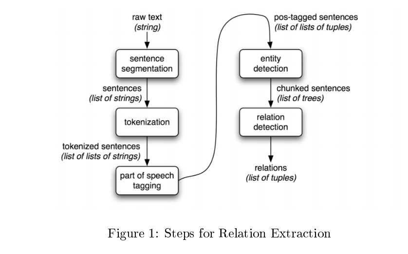
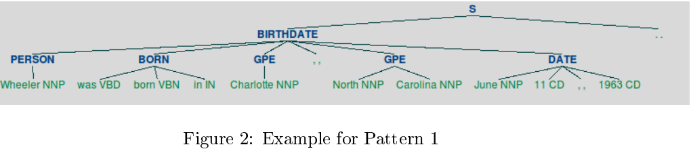
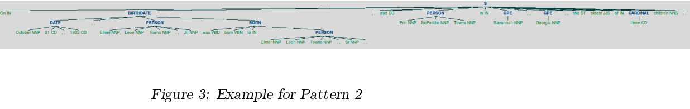
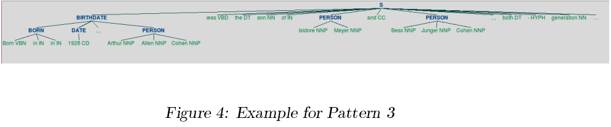
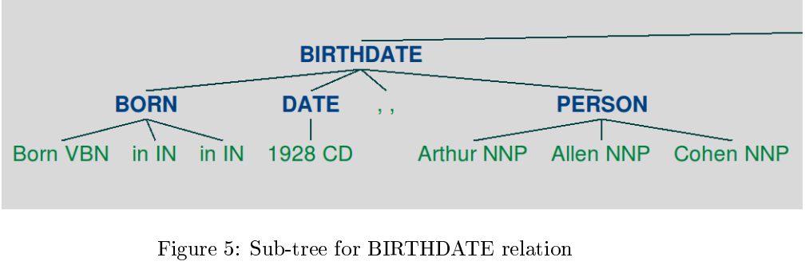

# Information Extraction


## Approach

Relation extraction from text involves the following steps:



The input file has a list of JSON objects that contains the sentence text, the POS (Part of Speech) tagging and  IOB tagging for the words/tokens of each sentence. This leaves the process of identifying the named entity and then subsequently extracting the relation from the sentence parse tree.

### Named Entity Identification
The IOB tags in association with the tokens contain the named entity relation of that token in the context of the sentence. For example, consider the token list shown below:
```
[ 1, "Jennifer", "jennifer", "NNP", "B-PERSON"],
[ 2, "Lynn", "lynn", "NNP", "I-PERSON"],
[ 3, "Lopez", "lopez", "NNP", "I-PERSON"],
[ 4, "was", "be", "VBD", "O"],
```
The IOB tagging of the token list contains information about the named entity (PERSON - Jennifer Lynn Lopez). The prefix 'B' enables us to identify the beginning of the named entity. The end of the named entity is either the start of another named entity (identified by an IOB tag with a different suffix like GPE or DATE) or the IOB tag 'O'. The named entities that are relevant to the relation extraction are PERSON and DATE entities. The IOB tags can be utilized to extract these named entities from the token list. The identified named entities (PERSON and DATE) are mapped to an **nltk.Tree** object which would aid in the subsequently parsing the POS tagged list to build the relation chunks.

### Relation Extraction
The list of tokens and named entities are utilized to build a sentence tree using the **nltk.RegexpParser** object. Each of the relations to be extracted is defined a separate grammar and then parsed with the **nltk.RegexpParser** object to generate a sentence tree (chunked sentences). This sentence tree is traversed to extract the relations in the sentence.

## {DateOfBirth} Relation
The grammar/regular expression that was defined for the DateOfBirth relation extraction is as shown below:
```
birthdate = r """
        BORN :
        { < VBD >? < VBN > < IN | PERSON | CC >*}
    BIRTHDATE :
        { < PERSON > <.|..|...| -. RB - >*
        < BORN > <.|..|...| -. RB -| BORN | PRP . >* < DATE >}
        { < DATE > <.|..|... >* < PERSON > <.|..|... >* < BORN >}
        { < BORN > < DATE >* <.|..|...| DATE >* < PERSON >}"""
```
The regular expression defined here tried to identify the occurrence of the following patterns in the sentence to extract the DateOfBirth relations:

**BORN** - `<VBD>?<VBN><IN|PERSON|CC>*` The regular expression pattern here tries to match a sequence of words that indicates that a PERSON was born. Some of the combinations it tries to match are:

* `[(was/VBD),(born/VBN),(on/IN)]`
* `[(Born/VBN),(on/IN)]`
* `[(was/VBD),(born/VBN)]`
* `[(was/VBD),(born/VBN), (PERSON George/NNP Keefer/NNP Brewer/NNP)]` - eg: _Reeves was born George Keefer Brewer on January 5, 1914, in Woolstock, Iowa, the son of Don Brewer and Helen Lescher._

**BIRTHDATE** - The pattern defined here tries to match the following family of sentences that are a part of the training set.

**Pattern 1** - `<PERSON><NODESET_A><BORN><NODESET_B><DATE>`
This accounts for a sentence where the subject is mentioned upfront (active). For example - _Wheeler was born in Charlotte, North Carolina June 11, 1963._


**Pattern 2** - `<DATE><NODESET_C ><PERSON><NODESET_C ><BORN>`
This accounts for a sentence where the date of birth is metioned prior to the subject. For example - _On October 21,  1932, Elmer Leon Towns, Jr. was born to Elmer Leon Towns, Sr., and Erin McFaddin Towns in Savannah, Georgia, the oldest of three children._



**Pattern 3** - `<BORN><DATE><NODESET_D><PERSON>` 
This accounts for a sentence, mostly passive, where the relation BORN occurs at the beginning of the sentence. For example - _Born in New York City in 1928, Arthur Allen Cohen was the son of Isidore Meyer and Bess Junger Cohen, both second-generation Americans._




## {HasParent} Relation

The regular expression that was defined for the HasParent relation extraction is as given below:
```
parents = r """
BORN :
    { < VBD >? < VBN > < IN | PERSON | CC >*}
ADDNINFO :
    { < - LRB - > <.|..| PERSON | DATE | BORN | PARENTS >* < - RRB - >}
PARENTS :
    { < IN > <.|..|...| DATE | HYPH >* < PERSON > <.|..|...| DATE | ADDNINFO | HYPH >*
<CC > <.|..|...| DATE | BORN | PRP . >* < PERSON >} # $A - First Regex
    { < BORN > < IN > < PERSON >}
    { < DT | NN | IN | DATE >+ < PERSON > < CC >* < PERSON >*} # $B - Second Regex
RELATION :
    { < BORN >* <.|..|...| DATE | >* < PERSON > < BORN >*
<.|..|...| DATE | ADDNINFO | BORN | PRP . >* < PARENTS >}
"""
```
The regular expression defined here tried to identify the occurrence of the following patterns in the sentence to extract the HasParent relations:

**BORN** - `{<VBD>?<VBN><IN|PERSON|CC>*}` As in the extraction of the DateOfBirth relation, the regular expression pattern here tries to match a sequence of words that indicates that a PERSON was born. Some of the combinations it tries to match are:

* `[(was/VBD),(born/VBN),(on/IN)]`
* `[(Born/VBN),(on/IN)]`
* `[(was/VBD),(born/VBN)]`
* `[(was/VBD),(born/VBN), (PERSON George/NNP Keefer/NNP Brewer/NNP)]` - eg: _Reeves was born George Keefer Brewer on January 5, 1914, in Woolstock, Iowa, the son of Don Brewer and Helen Lescher._

**ADDNINFO** - `{<-LRB-><.|..|PERSON|DATE|BORN|PARENTS>*<-RRB->}` The pattern here identifies any content given with  brackets such as - _Angela Crocetti (nee Barra; 1899-1966)_

**PARENTS** - This regular expression identifies the PERSON tags form the parent relation. The sentences can include details on a single parent or both the parents. If both the parents are mentioned, they (two PERSON tags) are likely to be separated by a conjugation which would be the tag to define the regular expression on. If only a single parent comes up, the PERSON tag is most likely preceded by a <BORN> and <IN> tag, that is a BORN relation and a preposition.


| Regex Pattern                            | Example for matched string               |
| ---------------------------------------- | ---------------------------------------- |
| `{<BORN><IN><PERSON>}`                   | was born to Elmer Leon Towns             |
| Second Regex $B (Check the Regex definition) | the son of Mary Evans                    |
| First Regex $A(Check the Regex definition) | the son of Isidore Meyer and Bess Junger Cohen |


**RELATION** - This regex pattern is used to associate the subject (defined by a <PERSON> tag) with the object (PARENTS tag) with the relation (BORN). The pattern groups the HasParent relation details in the sentence tree to a subtree (of tag RELATION). The parsed sentence tree would be as shown below:

Sentence: _Born in New York City in 1928, Arthur Allen Cohen was the son of Isidore Meyer and Bess Junger Cohen, both second-generation Americans._

```
(S
    (RELATION
        (BORN Born/VBN in/IN) in/IN
        (DATE 1928/CD)
        ,/,
        (PERSON Arthur /NNP Allen /NNP Cohen /NNP)
        was /VBD
        the /DT
        son /NN
        (PARENTS
            of /IN
            (PERSON Isidore /NNP Meyer /NNP)
            and/CC
            (PERSON Bess /NNP Junger /NNP Cohen /NNP) ) )
    ,/,
    both /DT
    −/HYPH
    generation /NN
    ./.
)
```

##  Relation Extraction
Once the defined regular expression for each relation (birth-date and parents) has been applied on the token list, the resulting parse sentence tree would have a sub tree (DateOfBirth - BIRTHDATE, HasParent - RELATION) that has the relation details. Filtering out the sub-tree from the sentence tree and traversing it to identify the subject and predicate of the relation would give us the relation.

Consider the sentence below:

Sentence: _Born in New York City in 1928, Arthur Allen Cohen was the son of Isidore Meyer and Bess Junger Cohen, both second-generation Americans._

```
( S
    (BIRTHDATE
        (BORN Born/VBN in/IN in/IN )
        (DATE 1928/CD)
        ,/,
        (PERSON Arthur /NNP Allen /NNP Cohen /NNP) )
    was /VBD
    the /DT
    son /NN
    of /IN
    (PERSON Isidore /NNP Meyer /NNP)
    and/CC
    (PERSON Bess /NNP Junger /NNP Cohen /NNP)
    ,/,
    both /DT
    −/HYPH
    generation /NN
    ./.
)
```


The leaf nodes of the sub-tree with the label=PERSON gives the subject [Arthur Allen Cohen] and the leaf nodes with the label=DATE gives the date of birth [1928].


##  Improvement
The relation extraction defined in the program has its basis on the following factors:

1. Initial Named entity recognition - The Named entities relations identified and mapped as the IOB tags were the basis for formulating the pattern based approach for relation extraction. If the named entities are not identified to sufficient accuracy the regular expression/grammar would fail to pull the relation details.
2. Accurate POS tagging for the sentence tokens - The accuracy of the POS tagging is important since the pattern is defined based on the POS tags to identify and retrieve information.

The dependency on these two factors implies that the program logic relies on the structure of the sentence rather than the content specified. The program is not trying to identify the relational tags such as BORN and PARENTS based on the content of each token. This would result is some ambiguity since the defined grammar for a relation can match a token sequence that does not necessarily imply the relation itself.


| Pattern                   | Match       | True Positive? |
| ------------------------- | ----------- | -------------- |
| `BORN:{<VBD>?<VBN><IN>*}` | was born on | true           |
| `BORN:{<VBD>?<VBN><IN>*}` | known as    | false          |


Inclusion of the content or token check to identify if the matched token sequence indicates a true positive of the relation might improve both the precision and recall of the program. The lemmatized token sequence can be defined as a reference to indicate the relation, such as the sequence `(<"date","of","birth">/ <"be","bear","on">)`. This will resolve the ambiguity in the relation identification.


## References

1. Extracting Information from Text - http://www.nltk.org/book/ch07.html
2. How to parse custom tags using nltk.Regexp.parser() - http://stackoverflow.com/questions/24975573/how-to-parse-custom-tagsusing-nltk-regexp-parser
3. How to identify and remove trace trees from nltk.trees? - http://stackoverflow.com/questions/33939486/how-to-identify-and-removetrace-trees-from-nltk-trees
4. Regular expression operations - https://docs.python.org/3/library/re.html